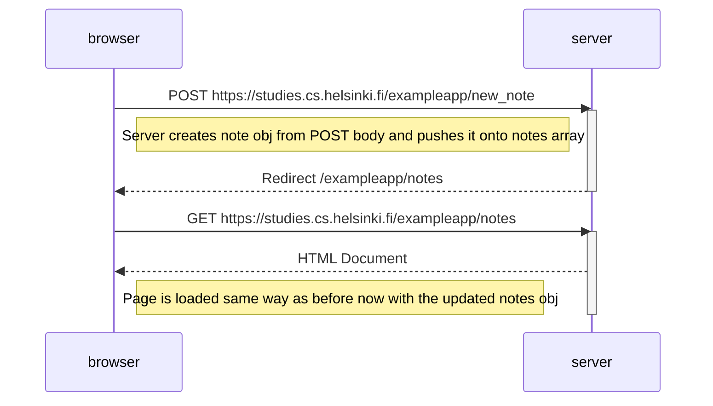

```mermaid
sequenceDiagram
    participant browser
    participant server

    browser->>server: POST https://studies.cs.helsinki.fi/exampleapp/new_note
    activate server
    Note left of server: Server creates note obj from POST body and pushes it onto notes array
    server-->>browser: Redirect /exampleapp/notes
	deactivate server
	
	browser->>server: GET https://studies.cs.helsinki.fi/exampleapp/notes
	activate server
	server-->>browser: HTML Document
	Note right of browser: Page is loaded same way as before now with the updated notes obj
	deactivate server
	

```