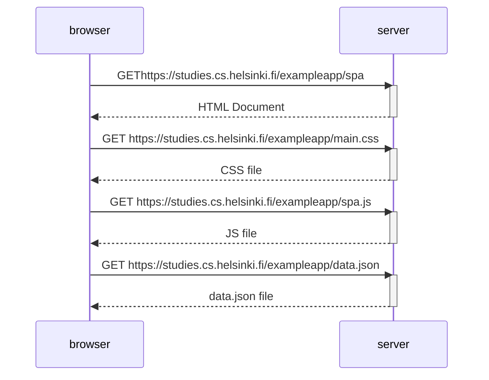

```mermaid

sequenceDiagram
participant browser
participant server

browser->>server: GEThttps://studies.cs.helsinki.fi/exampleapp/spa
activate server
server-->>browser: HTML Document
deactivate server

browser->>server: GET https://studies.cs.helsinki.fi/exampleapp/main.css
activate server
server-->>browser: CSS file
deactivate server

browser->>server: GET https://studies.cs.helsinki.fi/exampleapp/spa.js
activate server
server-->>browser: JS file
deactivate server

browser->>server: GET https://studies.cs.helsinki.fi/exampleapp/data.json
activate server
server-->>browser: data.json file
deactivate server
```